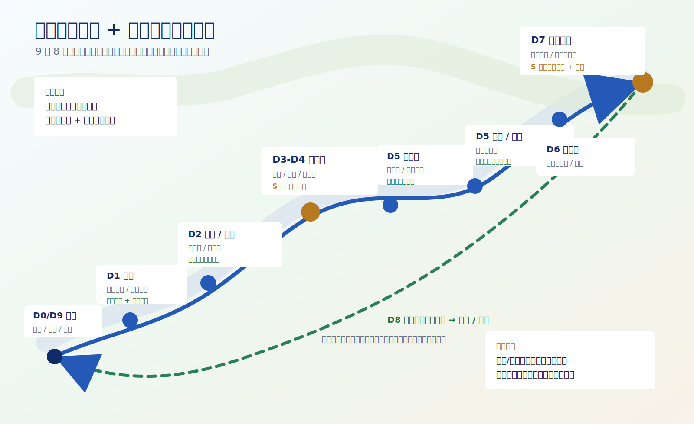

# 兰州出发甘南 + 莲宝叶则摄影攻略

生成日期：2026-06-25 19:15 CST  
核验基准：2026 夏秋摄影季；未指定具体出行日期，机票、酒店、天气和景区临时公告需按实际日期二次复核。  
推荐口径：兰州进出，包车或自驾，9 天 8 晚；8 天压缩版见文末。

这份是主执行攻略：只放路线、每天几点去哪、住宿区域、拍摄目标、交通边界和安全边界。票务/酒店/机票来源记录和复核方法放在 [甘南莲宝叶则_核验记录.md](甘南莲宝叶则_核验记录.md)，网页阅读版见 [gannan-verification.html](gannan-verification.html)。

## 独立文档入口

- 摄影执行：[甘南莲宝叶则_摄影手册.md](甘南莲宝叶则_摄影手册.md)，网页阅读版 [gannan-photo-handbook.html](gannan-photo-handbook.html)
- 光线天象规划：[甘南莲宝叶则_光线天象规划.md](甘南莲宝叶则_光线天象规划.md)，网页阅读版 [gannan-light-astro.html](gannan-light-astro.html)
- 大片交付清单：[甘南莲宝叶则_大片交付清单.md](甘南莲宝叶则_大片交付清单.md)，网页阅读版 [gannan-shot-list.html](gannan-shot-list.html)
- 每日手机执行卡：[甘南莲宝叶则_每日执行卡.md](甘南莲宝叶则_每日执行卡.md)，网页阅读版 [gannan-daily-cards.html](gannan-daily-cards.html)
- 移动端离线速查包：网页工具 [gannan-mobile-pack.html](gannan-mobile-pack.html)
- 机位地图索引：[甘南莲宝叶则_机位地图索引.md](甘南莲宝叶则_机位地图索引.md)，网页阅读版 [gannan-photo-map.html](gannan-photo-map.html)
- 国内地图导航包：[甘南莲宝叶则_国内地图导航包.md](甘南莲宝叶则_国内地图导航包.md)，网页阅读版 [gannan-china-map-pack.html](gannan-china-map-pack.html)
- 来源台账：[甘南莲宝叶则_来源台账.md](甘南莲宝叶则_来源台账.md)，网页阅读版 [gannan-source-ledger.html](gannan-source-ledger.html)
- 装备勾选：[甘南莲宝叶则_装备Checklist.md](甘南莲宝叶则_装备Checklist.md)，网页阅读版 [gannan-gear-checklist.html](gannan-gear-checklist.html)
- 司机/酒店/景区沟通：[甘南莲宝叶则_沟通Checklist.md](甘南莲宝叶则_沟通Checklist.md)，网页阅读版 [gannan-communication-checklist.html](gannan-communication-checklist.html)
- 出发前询价消息包：[甘南莲宝叶则_询价消息包.md](甘南莲宝叶则_询价消息包.md)，网页阅读版 [gannan-quote-templates.html](gannan-quote-templates.html)
- 出行信息填写器：网页工具 [gannan-input-wizard.html](gannan-input-wizard.html)
- 预算与订单核验：[甘南莲宝叶则_预算与订单核验表.md](甘南莲宝叶则_预算与订单核验表.md)，网页阅读版 [gannan-order-workbench.html](gannan-order-workbench.html)
- 订单候选模板：[甘南莲宝叶则_订单候选模板.md](甘南莲宝叶则_订单候选模板.md)，网页阅读版 [gannan-order-candidates.html](gannan-order-candidates.html)
- 反复核验 SOP：[甘南莲宝叶则_反复核验SOP.md](甘南莲宝叶则_反复核验SOP.md)，网页阅读版 [gannan-reverification-sop.html](gannan-reverification-sop.html)
- 高原天气应急预案：[甘南莲宝叶则_高原天气应急预案.md](甘南莲宝叶则_高原天气应急预案.md)，网页阅读版 [gannan-contingency-plan.html](gannan-contingency-plan.html)
- 最终核验矩阵：[甘南莲宝叶则_最终核验矩阵.md](甘南莲宝叶则_最终核验矩阵.md)，网页阅读版 [gannan-final-audit.html](gannan-final-audit.html)
- 票务/酒店/机票核验：[甘南莲宝叶则_核验记录.md](甘南莲宝叶则_核验记录.md)，网页阅读版 [gannan-verification.html](gannan-verification.html)

## 一图版路线逻辑

下面这张只保留兰州起止、甘南主线、莲宝叶则核心窗口和返程分段。




## 核心结论

1. 推荐 9 天 8 晚，不建议 6-7 天硬塞。扎尕那和莲宝叶则都需要完整拍摄窗口，否则容易只剩“到此一游”。
2. 甘南段以人文、寺院、草原、村寨晨雾为主；莲宝叶则以高海拔湖泊、石山、倒影和蓝调为主。
3. 路线默认兰州起止。若能接受异地还车或包车跨省，兰州进、成都出会少一段长回程，但成本和车辆调度更难。
4. 票务不要提前一次性买死。扎尕那、莲宝叶则、若尔盖花湖、黄河九曲第一湾都可能受天气、限流、景区交通和临时公告影响。
5. 海拔是硬约束。夏河约 2,900m，扎尕那约 3,000m，黄河九曲约 3,400m，阿坝县约 3,290m，莲宝叶则核心游览区约 4,000m 以上。不要把莲宝叶则安排在第一二天。
6. 无人机不作为刚需。寺院、景区、人群、机场/敏感区域、高原强风和电子围栏都可能限制飞行；能飞也要实名、报备、看现场禁飞牌。

## 最佳季节和拍摄重点

| 时间 | 画面优点 | 风险 | 推荐 |
|---|---|---|---|
| 6 月下旬-7 月中旬 | 草原绿色、野花、云影、黄河水量和湿地层次好 | 午后雷阵雨、高峰酒店涨价、路面施工/拥堵 | 最适合“草原 + 寺院 + 湿地”大片 |
| 8 月 | 草原仍绿，天气窗口多 | 暑期人流高、酒店价格高、雨后落石/泥水路 | 可去，但要更早订住宿 |
| 9 月下旬-10 月中旬 | 秋色、低云、扎尕那村寨层次、莲宝叶则冷峻感 | 国庆拥堵、早晚更冷、部分高海拔可能遇雪 | 最适合“秋色 + 石山 + 高原蓝调” |
| 11 月-次年 4 月 | 人少、雪山感强 | 高海拔寒冷、道路结冰、部分服务收缩 | 只建议有冬季高原自驾经验时考虑 |

## 9 天 8 晚推荐路线

| 天数 | 路线 | 车程口径 | 住宿建议 | 当天主片 |
|---|---|---:|---|---|
| D0 可选 | 抵达兰州，取车/见司机，采购补给 | 中川机场到市区约 1h 级别 | 兰州西站/兰州老街/机场附近 | 不安排拍摄 |
| D1 | 兰州 → 夏河 → 拉卜楞寺 → 贡唐宝塔 / 桑科草原 | 3.5-4.5h | 夏河拉卜楞寺步行圈 | 拉卜楞转经长廊、寺院金顶、桑科日落 |
| D2 | 夏河日出 → 甘加秘境：八角城 / 白石崖 → 合作 | 3-5h，按停留变化 | 合作市区 | 白石崖草原路、八角城俯瞰、米拉日巴佛阁蓝调 |
| D3 | 合作 → 迭部 / 扎尕那 → 达日观景台或业日村日落 | 5-6.5h | 扎尕那东哇/业日/达日村 | 扎尕那石城日落、村寨层次 |
| D4 | 扎尕那全天：日出、仙女滩、峡谷、村寨 | 景区内短驳+步行 | 扎尕那或迭部 | 晨雾、石峰、村寨炊烟、栈道光影 |
| D5 | 扎尕那日出 → 郎木寺 → 若尔盖花湖 → 唐克黄河九曲第一湾日落 | 5.5-7.5h | 唐克或若尔盖县城 | 郎木寺红石崖/寺院、花湖湿地、黄河九曲日落 |
| D6 | 唐克 / 若尔盖 → 瓦切塔林 / 红原月亮湾可选 → 阿坝县 | 4.5-6.5h | 阿坝县城 | 草原公路、经幡、黄河支流弯道；重点是休整适应海拔 |
| D7 | 阿坝县 → 莲宝叶则全天 → 阿坝县 | 单程约 45-70min，景区内按交通 | 阿坝县城 | 扎尕尔措倒影、石山湖泊、4520 观景台蓝调 |
| D8 | 阿坝县 → 玛曲 / 碌曲 / 合作，按体力分段 | 6.5-8.5h | 合作或临夏 | 返程路上的黄河、草原、经幡机动片 |
| D9 | 合作 / 临夏 → 兰州，返程航班或高铁 | 2.5-4.5h | 无或兰州 | 不加刚性景点 |

## 全程执行硬规则

```text
1. D1 不要下午从兰州硬冲扎尕那。第一天先到夏河适应海拔和节奏。
2. D2 甘加秘境拍完就走，别在八角城/白石崖消耗到天黑，否则 D3 去扎尕那太累。
3. D3 抵达扎尕那后只追一个日落机位，不要同时塞仙女滩、峡谷和村寨深度。
4. D4 扎尕那必须留全天。晨雾、石城、村寨、峡谷都靠天气开窗，半天不稳。
5. D5 黄河九曲第一湾是日落点，尽量 17:00 前到唐克区域；错过日落就把它降级为顺路景点。
6. D6 是高海拔缓冲日，不要晚上赶到莲宝叶则景区内折腾。
7. D7 莲宝叶则不要只买票进门打卡。至少留 6-8 小时，蓝调/倒影/高位观景台各拍一轮。
8. D8 从阿坝县直回兰州很长，除非双司机且状态很好，否则建议合作或临夏分段。
9. 午后雷阵雨、落石、塌方、景区短驳停运、临时限流时，宁可砍点，不赶夜路。
```

## Day 0｜可选｜抵达兰州

### 今日定位

```text
性质：抵达、取车、补给、睡眠日
核心任务：把车辆、氧气/药品、保暖和离线地图准备好
拍摄任务：无
```

### 执行建议

| 项目 | 建议 |
|---|---|
| 到达方式 | 若从外地飞来，优先飞兰州中川机场；机场到兰州市区再取车更稳。 |
| 取车 | 自驾建议选 SUV 或通过性较好的轿车；不建议低底盘车。 |
| 补给 | 水、葡萄糖/电解质、感冒药、肠胃药、晕车药、垃圾袋、纸巾、氧气瓶可在兰州补齐。 |
| 证件 | 身份证、驾驶证、租车合同、保险、酒店订单、景区预约截图离线保存。 |
| 睡眠 | 不熬夜修攻略。D1 开始就是高原路线，第一晚睡眠比多拍夜景重要。 |

## Day 1｜兰州 → 夏河｜拉卜楞寺 + 桑科草原

### 今日定位

```text
性质：进入甘南的适应日
核心任务：抵达夏河，完成拉卜楞寺主片和草原日落
主拍：转经长廊、贡唐宝塔视角、桑科草原晚光
住宿：夏河，优先拉卜楞寺步行圈或桑科方向好停车酒店
```

### 当天时间轴

| 时间 | 动作 | 备注 |
|---|---|---|
| 08:00 | 兰州出发 | 早出城，避开中午后山地天气变化 |
| 11:30-12:30 | 抵达夏河 / 午餐 / 入住或寄存 | 不要空腹上高海拔寺院爬楼 |
| 14:00-16:30 | 拉卜楞寺 | 转经长廊、晒佛台方向、寺院外观；寺内按规定不拍 |
| 16:30-17:30 | 贡唐宝塔或寺院外侧高点 | 拍寺院屋顶、金顶、夏河县城层次 |
| 18:00-20:00 | 桑科草原日落 | 云影、马、经幡、公路弯道；不要深夜骑马 |
| 20:30 | 回夏河休息 | 备份照片，确认 D2 甘加/合作路线 |

### 拍摄参数

| 场景 | 镜头 | 拍法 |
|---|---|---|
| 转经长廊 | 24-105mm / 70-200mm | 中长焦拍手、转经筒、光影和人物背影；尊重信众，不怼脸。 |
| 寺院屋顶 | 70-200mm | 压缩金顶、白墙、远山和云影。 |
| 桑科草原 | 24-105mm / 70-200mm | 低机位拍草线和马，长焦压云影；若有彩虹优先保留天空。 |

## Day 2｜夏河 → 甘加秘境 → 合作

### 今日定位

```text
性质：草原地貌 + 轻人文 + 中转
核心任务：拍甘加秘境，晚上住合作，给 D3 扎尕那留体力
主拍：八角城、白石崖、米拉日巴佛阁蓝调
```

### 当天时间轴

| 时间 | 动作 | 备注 |
|---|---|---|
| 06:30-08:00 | 拉卜楞寺清晨可选 | 如果 D1 寺院已拍满意，可直接睡到 07:30 |
| 08:30 | 夏河出发去甘加 | 查天气，雨雾大则缩短停留 |
| 09:30-12:30 | 甘加秘境 / 八角城 / 白石崖 | 路边停车注意安全；高海拔不跑跳 |
| 12:30-14:00 | 午餐 / 前往合作 | 控制节奏 |
| 15:00-17:00 | 合作市区休整 | 加油、补给、洗车窗、充电 |
| 18:30-20:30 | 米拉日巴佛阁蓝调 | 金色立面 + 蓝调天空，拍完回酒店 |

### 拍摄参数

| 场景 | 镜头 | 拍法 |
|---|---|---|
| 八角城 | 24-105mm | 拍城墙几何和远山；无人机只有在合法且现场允许时再飞。 |
| 白石崖 | 70-200mm | 长焦压缩白色崖壁、牛羊、云影。 |
| 米拉日巴佛阁 | 24-105mm / 14-24mm | 日落后 20-40 分钟蓝调最佳；三脚架或高 ISO 手持。 |

## Day 3｜合作 → 扎尕那｜抵达石城日落

### 今日定位

```text
性质：长转场 + 扎尕那第一眼
核心任务：天黑前抵达扎尕那，抢一个日落机位
主拍：达日观景台 / 业日村 / 东哇村附近村寨层次
住宿：扎尕那东哇村、业日村、达日村或迭部县城
```

### 当天时间轴

| 时间 | 动作 | 备注 |
|---|---|---|
| 08:00 | 合作出发 | 今日不加甘加回头路 |
| 12:00-13:30 | 碌曲 / 迭部方向午餐 | 视路况决定 |
| 15:00-16:30 | 抵达扎尕那 / 入住 / 找机位 | 先确认停车、热水、晚饭 |
| 17:00-20:00 | 达日观景台或业日村日落 | 只选一个，不跑多个点 |
| 20:30 | 晚餐 / 备份 / 看 D4 天气 | 高原别喝酒 |

### 机位选择

| 机位 | 适合 | 备注 |
|---|---|---|
| 达日观景台 | 经典石城全景、村寨层次 | 日落和晨雾都稳，适合第一次到扎尕那。 |
| 业日村附近 | 村寨近景、炊烟、石山压缩 | 更生活化，适合 70-200mm。 |
| 东哇村民宿窗景 | 懒人晨雾备份 | 住宿窗景不等于主机位，不能完全依赖。 |

## Day 4｜扎尕那全天

### 今日定位

```text
性质：本行程甘南段核心拍摄日
核心任务：晨雾、石峰、村寨、峡谷各拿一组
住宿：建议继续住扎尕那，避免日出前长车程
```

### 当天时间轴

| 时间 | 动作 | 备注 |
|---|---|---|
| 05:20-08:00 | 达日 / 业日 / 东哇晨雾 | 提前查日出，山区见光会晚 10-30 分钟 |
| 08:00-09:30 | 早餐 / 休整 | 不要空腹走栈道 |
| 10:00-12:30 | 仙女滩 / 栈道 | 拍石山、草坡、人像环境 |
| 12:30-15:30 | 午餐 / 午休 | 中午强光不硬拍 |
| 16:00-18:00 | 峡谷或村寨深拍 | 按天气选，雨后谨慎进沟 |
| 18:00-20:00 | 第二个日落机位 | D3 拍达日，D4 可换业日或反向村寨 |

### 拍摄参数

| 场景 | 镜头 | 拍法 |
|---|---|---|
| 晨雾石城 | 70-200mm | 先长焦压缩石峰和村寨，再补 24-105mm 环境。 |
| 仙女滩 | 24-105mm / 14-24mm | 低机位用草坡作前景，人物只做尺度，不要挡石山主体。 |
| 村寨人文 | 70-200mm | 拍背影、牦牛、炊烟、屋顶和远山，不闯私人院落。 |
| 雨后云雾 | 24-105mm | 抓短开窗，曝光略欠，保云层细节。 |

## Day 5｜扎尕那 → 郎木寺 → 若尔盖花湖 → 唐克

### 今日定位

```text
性质：高强度串联日
核心任务：上午补扎尕那，下午湿地，傍晚黄河九曲日落
住宿：唐克优先；若订不到或天气差，住若尔盖县城
```

### 当天时间轴

| 时间 | 动作 | 备注 |
|---|---|---|
| 05:30-07:30 | 扎尕那日出补拍 | 若 D4 已成功，可睡晚一点 |
| 08:00 | 出发去郎木寺 | 今日不要进深度徒步 |
| 10:30-12:30 | 郎木寺 / 纳摩峡谷轻拍 | 两寺分属甘肃/四川侧，现场按时间取舍 |
| 13:30-16:00 | 若尔盖花湖 | 栈道湿地、鸟、云影；风大注意保暖 |
| 17:00 前 | 到唐克 / 黄河九曲第一湾 | 日落点，迟到价值大幅下降 |
| 17:30-20:30 | 黄河九曲第一湾日落 | 长焦拍河曲、栈道、人影、金色水面 |

### 拍摄参数

| 场景 | 镜头 | 拍法 |
|---|---|---|
| 郎木寺 | 24-105mm / 70-200mm | 拍红石崖、寺院外观、僧人背影；不拍天葬台。 |
| 若尔盖花湖 | 70-200mm | 鸟类距离远，70-200mm 只拍环境鸟和湿地层次，不硬追特写。 |
| 黄河九曲 | 70-200mm / 24-105mm | 日落前先找高位，长焦压缩河道弯曲；蓝调补一张冷暖对比。 |

## Day 6｜唐克 / 若尔盖 → 阿坝县

### 今日定位

```text
性质：莲宝叶则前的高海拔缓冲日
核心任务：安全抵达阿坝县，休整，给 D7 留体力
主拍：草原公路、经幡、月亮湾/瓦切塔林可选
```

### 当天时间轴

| 时间 | 动作 | 备注 |
|---|---|---|
| 08:30 | 唐克 / 若尔盖出发 | 若前晚日落失败，可早起补黄河晨光后再走 |
| 10:00-12:00 | 瓦切塔林或红原月亮湾可选 | 按路线和天气取舍 |
| 12:00-15:30 | 前往阿坝县 | 不赶夜路 |
| 16:00-18:30 | 阿坝县入住 / 补给 / 轻拍 | 查 D7 莲宝叶则开放、短驳、天气 |
| 20:30 | 早睡 | D7 海拔更高，今天不喝酒不熬夜 |

### 住宿要求

| 要求 | 原因 |
|---|---|
| 有暖气或电热毯 | 阿坝县早晚冷，D7 清晨出发需要睡好。 |
| 热水稳定 | 高原湿冷，热水比装修重要。 |
| 可停车 | D7 早出发，不要折腾找车。 |
| 前台能协助确认景区 | 莲宝叶则临时交通、天气和门票最好让当地人再问一次。 |

## Day 7｜莲宝叶则全天

### 今日定位

```text
性质：全程第二核心拍摄日
核心任务：扎尕尔措、石山湖泊、4520 观景台、蓝调和倒影
住宿：继续阿坝县，避免高海拔夜间折返过累
```

### 当天时间轴

| 时间 | 动作 | 备注 |
|---|---|---|
| 06:30 | 阿坝县出发 | 具体按季节日出调整；先确认景区开放和交通 |
| 07:30-09:30 | 景区入口 / 第一湖区 / 扎尕尔措方向 | 高海拔慢走，先拍安全图 |
| 09:30-12:30 | 扎尕尔措 / 湖边石山倒影 | 风小时优先倒影，风大转长焦纹理 |
| 12:30-14:30 | 午餐 / 车内休整 / 低强度移动 | 不要中午硬爬高位 |
| 14:30-17:30 | 盘羊坪 / 高位观景台 / 4520 方向 | 以景区实际开放和身体状态为准 |
| 17:30-20:00 | 日落和蓝调 | 若景区要求闭园前离开，严格服从 |
| 20:30-21:30 | 回阿坝县 | 夜路谨慎，备份照片 |

### 莲宝叶则拍摄参数

| 场景 | 镜头 | 拍法 |
|---|---|---|
| 湖泊倒影 | 24-105mm / 70-200mm | 风小先拍对称倒影，CPL 谨慎使用，别把倒影消掉。 |
| 石山压缩 | 70-200mm | 把尖峰、湖岸、人物尺度压在一起，曝光略欠保石山层次。 |
| 高位观景台 | 24-105mm | 拍湖泊串联、道路曲线和人车尺度。 |
| 蓝调 | 三脚架 + 24-105mm | 日落后 20-35 分钟，湖面和石峰冷暖过渡最好。 |
| 人像大片 | 70-200mm | 人离背景远，压缩石山；不要站到湿滑湖岸或封闭区域。 |

### 安全边界

```text
1. 海拔高，所有动作慢半拍。头痛、胸闷、恶心、步态不稳时立刻下降强度。
2. 不为了倒影下湿滑湖岸，不翻越护栏，不走未开放支线。
3. 午后雷阵雨时远离高点、孤立金属物和湖边开阔地。
4. 景区交通和闭园时间高于摄影计划，不能为蓝调滞留违规区域。
```

## Day 8｜阿坝县 → 合作 / 临夏

### 今日定位

```text
性质：长返程第一段
核心任务：安全离开高海拔区域，分段回兰州
拍摄：只做顺路机动，不加刚性景点
```

### 执行建议

| 选择 | 适合 | 备注 |
|---|---|---|
| 阿坝县 → 合作 | 想 D9 上午轻松回兰州 | 路程仍长，早点出发。 |
| 阿坝县 → 临夏 | 想 D9 更接近兰州 | 当天车程更长，只适合状态好。 |
| 阿坝县 → 兰州直达 | 双司机、天气好、全员状态好 | 不作为默认推荐；太容易变成疲劳驾驶。 |

## Day 9｜合作 / 临夏 → 兰州

### 今日定位

```text
性质：返程日
核心任务：还车、返程航班/高铁，不加刚性景点
```

### 当天时间轴

| 时间 | 动作 | 备注 |
|---|---|---|
| 08:30 | 合作 / 临夏出发 | 按返程航班倒推 |
| 11:30-13:30 | 抵达兰州 | 吃饭、整理行李、还车 |
| 返程前 3h | 到机场或高铁站 | 中川机场距离市区远，别卡点 |

## 8 天压缩版

如果只能 8 天，压缩方式如下：

| 天数 | 路线 | 牺牲 |
|---|---|---|
| D1 | 兰州 → 夏河 → 拉卜楞寺 | 不变 |
| D2 | 夏河 → 甘加秘境 → 合作 → 扎尕那 | 当天车程变长，米拉日巴佛阁只作路过或取消 |
| D3 | 扎尕那全天 | 不变 |
| D4 | 扎尕那 → 郎木寺 → 花湖 → 唐克日落 | 不变，但早起压力大 |
| D5 | 唐克 → 阿坝县 | 不变 |
| D6 | 莲宝叶则全天 | 不变 |
| D7 | 阿坝县 → 合作 / 临夏 | 不变 |
| D8 | 合作 / 临夏 → 兰州 | 不变 |

压缩版的底线：不要压掉扎尕那全天，也不要压掉莲宝叶则全天。宁可砍甘加秘境或米拉日巴佛阁。

## 住宿策略

| 晚数 | 区域 | 选择逻辑 | 避坑 |
|---|---|---|---|
| D0 | 兰州 | 飞机晚到住机场附近；白天到住兰州西站/市区取车方便处 | 不要住到第二天出城反方向 |
| D1 | 夏河 | 拉卜楞寺步行圈优先，方便清晨和傍晚拍摄 | 不只看装修，优先热水、停车、供暖 |
| D2 | 合作 | 市区酒店，停车、早餐、补给方便 | 不为了网红民宿绕路 |
| D3-D4 | 扎尕那 | 东哇/业日/达日村山景民宿或迭部县城 | 村内民宿景观好但硬件不稳；县城舒适但日出远 |
| D5 | 唐克 / 若尔盖 | 拍黄河九曲日落住唐克；追舒适住若尔盖县城 | 日落后从唐克开远路风险高 |
| D6-D7 | 阿坝县 | 住县城最稳，去莲宝叶则单程 45-70min 级别 | 景区附近选择少，先确认热水、供暖、供氧 |
| D8 | 合作 / 临夏 | 返程分段，第二天轻松回兰州 | 不默认阿坝县直冲兰州 |

## 交通和车辆

| 项目 | 推荐 |
|---|---|
| 出行方式 | 2-4 人优先包车；熟悉高原山路再自驾。 |
| 车型 | SUV 或通过性较好的车；轮胎、备胎、胎压、玻璃水、刹车必须确认。 |
| 导航 | 高德/百度离线地图 + 司机当地经验；山区不要只信预计时间。 |
| 加油 | 兰州、夏河、合作、迭部、若尔盖、阿坝县都要见站就补，不要压到油表报警。 |
| 夜路 | 尽量不走。高原路段有牲畜、落石、雾、急弯和临时施工。 |
| 氧气 | 可备便携氧气，但不能用氧气硬撑继续高强度活动。明显高反要休息或下降。 |

## 全程装备

### 摄影器材

| 器材 | 结论 | 用途 |
|---|---|---|
| 14-24mm | 建议带 | 扎尕那栈道、寺院建筑、莲宝叶则湖泊大景、星空备选。 |
| 24-105mm | 必带 | 全程挂机，交通、寺院、草原、村寨、湖泊都用。 |
| 70-200mm | 必带 | 拉卜楞人文、白石崖压缩、扎尕那石城、花湖、黄河九曲、莲宝叶则石山。 |
| 三脚架 | 建议必带 | 蓝调、星空、黄河九曲日落、莲宝叶则倒影。 |
| CPL | 建议带 | 草原云影、湿地、湖泊反光；拍倒影时谨慎。 |
| ND | 可选 | 云流/水面慢门用，非刚需。 |
| 雨罩/干袋 | 必带 | 午后雷阵雨、高原风雨、湿地栈道。 |

### 高原和天气

| 类别 | 必带 |
|---|---|
| 保暖 | 冲锋衣或防风外套、抓绒/轻羽绒、薄手套、帽子。 |
| 防晒 | 高倍防晒、墨镜、帽子、润唇膏。 |
| 药品 | 常用药、肠胃药、感冒药、止痛药、创可贴、电解质。高反药请按医生建议。 |
| 鞋 | 防滑徒步鞋或越野鞋；寺院和栈道都不建议拖鞋。 |
| 数据 | 每晚双备份：移动硬盘 + 云端或第二张卡。 |

## 现场沟通清单

### 给司机 / 包车师傅

```text
这趟主要是摄影，不是打卡。请帮我们每天优先保证日出、日落机位和安全车程。
如果天气、路况或景区政策不适合，我们可以砍景点，但不要赶夜路。
扎尕那和莲宝叶则是重点，请这两天尽量早出发、晚一点收，但必须遵守景区闭园和交通规则。
```

### 给酒店 / 民宿

```text
我们可能清晨 5 点左右出门拍照，请确认能否提前开门、停车是否方便、是否有热水和供暖。
如果可以，请帮忙问一下明天景区是否正常开放、是否需要预约、观光车最早几点。
```

### 在寺院和村寨

```text
寺院内部、佛像、僧人近距离、人家院落，先问再拍；不确定就不拍。
拍人文以背影、手部、环境为主，不打扰信众和当地生活。
```

## 出发前复核节奏

| 时间 | 必查 |
|---|---|
| T-14 至 T-10 | 机票/高铁到兰州、租车或包车、核心住宿：夏河、扎尕那、唐克/若尔盖、阿坝县。 |
| T-7 | 景区预约和门票政策、扎尕那/莲宝叶则开放公告、车辆保险、证件。 |
| T-3 | 天气趋势、道路施工/塌方、酒店是否保留房间、司机是否确认路线。 |
| T-1 | 次日天气、日出日落、景区营业/观光车、酒店早餐/早出门、油量和离线地图。 |
| 每晚 | 备份照片、充电、查第二天路况和天气，决定砍点或换机位。 |

## 总判断

这条线要拍出大片，胜负不在景点数量，而在两个动作：扎尕那和莲宝叶则各留完整窗口，所有转场日不贪。甘南的照片靠云影、晨雾、人文秩序和草原尺度；莲宝叶则靠高海拔湖泊的安静、石山轮廓和蓝调。路线只要按“早出门、少赶夜路、雨天砍点、尊重寺院和景区规则”执行，成功率会比普通打卡团高很多。
