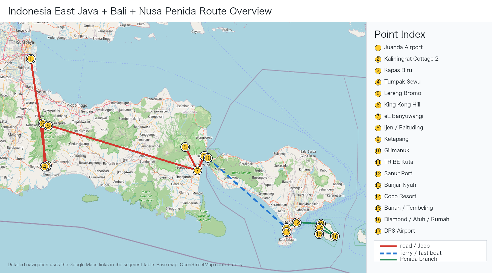

# 印尼东爪哇 + 佩尼达摄影行程完整增强版

生成日期：2026-06-08  
原始行程：[行程.md](行程.md)

说明：这个版本是主行程执行文档，只保留 Day 1-8 的时间、地点、交通、住宿和安全边界。摄影执行、装备清单、导游/司机话术、来源记录分别独立成文档。`行程.md` 已同步为同一 Penida 执行口径，避免现场误读旧路线。

## 一图版路线图

下面这张只保留 Java/Bali/Nusa Penida 路线、点位、交通方式和保守时间 。



## 全程逐日时间线总表

| 日期 | 时间 | 地点 / 动作 | 执行备注 |
|---|---|---|---|
| D1 前夜 6/12 | 23:00 前后 | 深圳宝安机场 | 提前办理 SQ857，托运行李按票面 30kg/人 |
| D1 6/13 | 02:05-06:10 | 深圳 → 新加坡 | SQ857，抵达后在樟宜机场转机、吃饭、休息 |
| D1 6/13 | 06:10-13:20 | 新加坡樟宜机场 | 长转机，补睡、充电、整理入境材料 |
| D1 6/13 | 14:20-15:40 | 新加坡 → 泗水 | SQ926，抵达泗水朱安达机场 T2 |
| D1 6/13 | 16:40-17:00 | 泗水机场出关取行李、司机接机 | 联系司机和酒店，路上安排晚餐/便利店 |
| D1 6/13 | 17:00-22:00/23:00 | 泗水 → Kaliningrat Cottage 2 | 专车长转场，晚到正常 |
| D1 6/13 | 22:00-23:30 | Kaliningrat Cottage 2 入住 | 充电、装 24-105mm、雨罩/干袋放外袋 |
| D2 6/14 | 05:10-05:30 | Kaliningrat Cottage 2 起床出发 | 防滑鞋、三脚架、雨罩、CPL/ND 放外袋 |
| D2 6/14 | 05:45-06:30 | Kapas Biru Panoramic View | 只去观景台，拍 Semeru、瀑布、峡谷层次 |
| D2 6/14 | 06:30-06:55 | Kapas Biru → Tumpak Sewu | 转到 Lumajang 侧入口 |
| D2 6/14 | 07:00-07:50 | Tumpak Sewu 上方观景台 | 先拍马蹄形瀑布安全图 |
| D2 6/14 | 08:00-10:30 | Tumpak Sewu 谷底 / Goa Tetes 可选 | 只在路况、水量、天气安全时执行 |
| D2 6/14 | 10:30-12:15 | 上撤、换衣、午餐 | 12:30 是离开硬截止 |
| D2 6/14 | 12:30-17:30/18:30 | Tumpak Sewu → Lereng Bromo Hotel | 长转场，不加临时景点 |
| D2 6/14 | 19:00-21:30 | Bromo 酒店晚餐、确认 Jeep、睡觉 | 为 D3 凌晨出发留睡眠 |
| D3 6/15 | 03:15-03:20 | Lereng Bromo Hotel Jeep 接人 | 目标 King Kong Hill / Bukit Kedaluh |
| D3 6/15 | 04:00-04:15 | King Kong Hill 到位 | 占位、架三脚架，先拍蓝调/星空尾声 |
| D3 6/15 | 05:15-06:15 | Bromo 日出主拍 | 70-200mm 压缩 Bromo、Batok、Semeru |
| D3 6/15 | 06:15-07:00 | 观景台补拍 | 拍云海、人群、山脊和环境图 |
| D3 6/15 | 07:00-08:30 | 沙海 | Jeep 车辙、马队、火山灰纹理 |
| D3 6/15 | 08:30-09:00 | Pura Luhur Poten / 安全边界 | 官方限制未解除时不进 crater 1 km |
| D3 6/15 | 09:00-10:00 | 返回酒店 | 早餐、洗澡、备份照片 |
| D3 6/15 | 10:00-15:30 | 酒店休息 | 午睡，减少 D4/D5 疲劳 |
| D3 6/15 | 15:30-17:30 | 酒店附近轻拍 / 休息 | 不安排高强度项目 |
| D3 6/15 | 19:00-21:00 | 晚餐、备份、准备二刷 | D4 是否补拍按 D3 成片和天气决定 |
| D4 6/16 | 04:30-05:00 | 可选二刷 Bromo 出发 | D3 成功则换 Penanjakan 1 / Bukit Cinta；D3 失败继续 King Kong；Mentigen Hill 只作 C 级备选 |
| D4 6/16 | 05:20-06:30 | Bromo 观景台补拍 | 只补日出和火山层次，不重复沙海 |
| D4 6/16 | 06:30-08:30 | 返回酒店、早餐、退房 | 收拾行李，准备长转场 |
| D4 6/16 | 09:00-17:00/18:30 | Bromo → eL Hotel Banyuwangi | 7-9 小时专车，不加景点 |
| D4 6/16 | 19:00-21:30 | Banyuwangi 晚餐、Ijen 准备 | 头灯、防毒面具、保暖层、登山包就位 |
| D5 6/17 | 00:50-01:30 | eL Hotel 起床、出发去 Paltuding | 争取蓝火窗口需 01:15-01:30 出发 |
| D5 6/17 | 02:30-03:00 | Pos Paltuding 登山口 | 确认开放范围、面具、头灯和路线 |
| D5 6/17 | 03:00-04:45/05:00 | 徒步到 Ijen crater rim | 蓝火只作条件项目，火山湖日出优先 |
| D5 6/17 | 05:20-06:30 | Ijen 火山湖日出 | 拍火山湖、硫磺烟、山脊和矿工人文 |
| D5 6/17 | 06:30-08:30 | 下山回 Paltuding | 防滑，避免硫磺烟下风侧停留 |
| D5 6/17 | 10:00-12:00 | 回 eL Hotel 洗澡早餐、退房 | 整理湿衣物和相机 |
| D5 6/17 | 12:00-14:15 | eL Hotel → Ketapang → Gilimanuk | 渡轮后切换 WITA，巴厘岛时间 +1 小时 |
| D5 6/17 | 15:15-18:30/20:30 | Gilimanuk → TRIBE Bali Kuta Beach | 长车程，抵达后只整理 Penida 装备 |
| D6 6/18 | 06:30-07:00 | TRIBE Kuta 出发去 Sanur | 08:30 船需留 check-in 和堵车余量 |
| D6 6/18 | 08:30-09:15 | Sanur → Nusa Penida | 快船，按船司确认到达港 |
| D6 6/18 | 10:00-12:30 | 上午浮潜 2-3 点 | 早上海况和能见度通常更稳；点位听船家 |
| D6 6/18 | 12:30-13:15 | 冲洗 / 午餐 | 简化补水，尽快切回陆地段 |
| D6 6/18 | 13:30-14:05 | Angel's Billabong | 低潮浪小时快速拍潮池；浪大只看不下湿岩 |
| D6 6/18 | 14:05-14:35 | Broken Beach | 与 Angel 同组，拍天然拱和圆形海湾 |
| D6 6/18 | 14:35-15:15 | 前往 Kelingking Beach | 路况慢就直接砍 Banah |
| D6 6/18 | 15:15-16:05 | Kelingking Beach / Viewpoint / 可下上段拍沙滩视角 | 默认不下到底部；若完整下沙滩，当天改成 Kelingking 单点深拍 |
| D6 6/18 | 16:05-16:25 | Paluang Cliff 白天景色 + 日落踩点 | Kelingking 同组侧面机位，先拍白天侧面，预判傍晚是否切这里 |
| D6 6/18 | 16:25-17:20 | Banah Cliff Point 快速拍照 | 仅路干、司机确认、能 17:30 前回 Kelingking 时执行 |
| D6 6/18 | 17:30-18:10 | 回 Kelingking Beach 拍日落 | D6 主片；日落约 18:07 WITA |
| D6 6/18 | 18:30-22:00 | Coco Resort Penida 入住、晚餐、休息 | 若天气极好可酒店附近安全空地试拍银河 |
| D7 6/19 | 05:30-05:45 | Coco Resort 出发去东线 | 东线远，早出发避开日返人流 |
| D7 6/19 | 07:15-08:30 | Diamond Beach 高位 | 拍白崖、海蚀岩、台阶和浪线，不高体力下切 |
| D7 6/19 | 08:45-09:45 | Atuh Beach 高位 | 长焦等浪线和海蚀拱岩 |
| D7 6/19 | 10:00-11:30 | Rumah Pohon / Thousand Islands | 拍树屋、Raja Lima、Thousand Islands 背景 |
| D7 6/19 | 11:30-13:00 | 午餐 / 东线机动 | 若前面拥堵，用午餐压缩机动时间 |
| D7 6/19 | 13:00-15:00 | 回港路上机动 | 西线不重复；除非东线取消，否则不再补 Broken / Angel / Kelingking |
| D7 6/19 | 15:30 | Nusa Penida 港口 check-in | 覆盖 16:30 回程船 |
| D7 6/19 | 16:30-17:15 | Nusa Penida → Sanur | 回 Bali 后专车去 Kuta |
| D7 6/19 | 18:30-20:00 | TRIBE Bali Kuta Beach | 洗澡、备份、整理返程行李 |
| D8 6/20 | 07:30-09:00 | Kuta 酒店周边可选轻拍 | 只在自然醒且行李完成时执行 |
| D8 6/20 | 09:00-10:00 | 酒店退房、去 DPS 机场 | 10:00 到机场保守执行 |
| D8 6/20 | 13:20-16:20 | DPS → 吉隆坡 | 亚航，电池和充电宝随身 |
| D8 6/20 | 16:20-21:45 | 吉隆坡中转 | 吃饭、补水、检查登机口 |
| D8 6/20 | 21:45-01:55+1 | 吉隆坡 → 深圳 | 抵达后优先取行李和备份照片 |


## 全程执行硬规则

```text
1. D3 Bromo Jeep 建议 03:15-03:20 接，04:00-04:15 到 King Kong / Bukit Kedaluh。
2. D3 Bromo 当前按 TNBTS 官方限制处理：不进入 crater 1 km，最多到 Pura Luhur Poten；出发前确认线上票和 QR。
3. D5 Ijen 如果争取蓝火，建议 01:15-01:30 从 eL Hotel 出发；03:30 起走更像火山湖日出版。
4. D5 Ketapang-Gilimanuk 必须写清 WIB/WITA 时差，不能只写一个时间。
5. D6 Kuta 去 Sanur 码头建议 06:45-07:00 出发，留 check-in 和拥堵余量。
6. D6 按我们的摄影优先级协调旅行社：上午先浮潜；下午按 Angel's Billabong → Broken Beach → Kelingking Beach → Paluang Cliff 白天景色/日落踩点 → Banah Cliff Point → 回 Kelingking Beach 日落执行。Paluang 很近，Banah 只在路况和返程时间允许时去。
7. D7 Coco Resort 去东线很远，建议 05:30-05:45 出发，不做 Diamond Beach 高体力下切。
8. Mentigen Hill 只作 Bromo C 级救场备选，不替代 D3 King Kong 或 D4 Penanjakan / Bukit Cinta。
```

## 独立文档入口

- 摄影执行：[摄影手册_独立版.md](摄影手册_独立版.md)
- 天象专项：[天象专项_银河日出日落月相.md](天象专项_银河日出日落月相.md)
- 装备勾选：[装备Checklist.md](装备Checklist.md)
- 导游/司机/船家话术：[导游沟通Checklist.md](导游沟通Checklist.md)
- 来源记录：[行程核验与摄影机位大片参考.md](行程核验与摄影机位大片参考.md)

# 每日执行版

# 印尼东爪哇 + 佩尼达摄影行程执行版

## 行程概览

**日期：** 6 月 13 日 – 6 月 20 日
**路线：** 深圳 → 新加坡 → 泗水 → Pronojiwo → Bromo → Banyuwangi / Ijen → 巴厘岛 Kuta → Nusa Penida → Kuta → 深圳
**主题：** 火山、瀑布、火山湖、佩尼达海岛
**重点：** Sewu / Kapas Biru、Bromo 双日出、Ijen 火山湖、Penida 浮潜与东线

---

## 核心原则

```text
1. D2 Kapas Biru 必须写成 Kapas Biru Panoramic View。
2. D3 Bromo 主拍机位优先 King Kong Hill / Bukit Kingkong。
3. D4 Bromo 二次拍摄不重复火山口。
4. D5 Ijen 以火山湖日出为主，蓝火视开放情况。
5. D6 让旅行社配合我们的节奏：上午浮潜；下午 Angel / Broken，Kelingking 可拍上段沙滩视角，Paluang 补白天侧面并踩日落点，Banah 条件快拍，最后回 Kelingking 日落。
6. D7 Penida 东线拍高位机位，不做高体力下切。
7. D8 回国日不加景点。
```

---

# Day 1｜6 月 13 日｜深圳 → 新加坡 → 泗水 → Pronojiwo

## 今日定位

```text
性质：长途转场日
核心任务：抵达 Kaliningrat Cottage 2
拍摄任务：无
重点：安全到酒店、吃饭、充电、休息
```

## 航班

### 深圳 → 新加坡

```text
航班：SQ857
起飞：02:05 深圳宝安国际机场
到达：06:10 新加坡樟宜机场
机型：Boeing 737 MAX 8
飞行时间：4小时05分
行李：免费托运行李 30kg/人
```

### 新加坡 → 泗水

```text
航班：SQ926
起飞：14:20 新加坡樟宜机场 T2
到达：15:40 泗水朱安达机场 T2
机型：Boeing 737 MAX 8
飞行时间：2小时20分
```

## 当天时间轴

```text
23:00 前后  抵达深圳宝安机场
02:05       深圳 → 新加坡 SQ857
06:10       抵达新加坡
06:10–13:20 樟宜机场转机、吃饭、休息
14:20       新加坡 → 泗水 SQ926
15:40       抵达泗水
16:40–17:00 出机场，司机接机
17:00–22:00/23:00 专车前往 Kaliningrat Cottage 2
22:00–23:00 入住
23:30 前后  休息
```

## 住宿

```text
酒店：KALININGRAT COTTAGE 2
地址：Jl. Raya Besuk, Cukit, Sidomulyo, Pronojiwo, Lumajang Regency, East Java 67374
```

## 晚上准备

```text
相机电池充满
手机和充电宝充满
镜头提前装好 24-105mm
防水袋、雨罩、镜头布放进包
准备第二天防滑鞋
早点睡
```

---

# Day 2｜6 月 14 日｜Kapas Biru Panoramic View + Tumpak Sewu → Bromo

## 今日定位

```text
性质：瀑布峡谷 + 长途转场
出发地：Kaliningrat Cottage 2
终点：Lereng Bromo Hotel
核心拍摄：
- Kapas Biru Panoramic View
- Tumpak Sewu 上方观景台
- Tumpak Sewu 谷底，视天气和水量
```

## 当天时间轴

```text
05:10  起床
05:30  Kaliningrat Cottage 2 出发
05:45  Kapas Biru Panoramic View
05:45–06:30  拍 Semeru + Kapas Biru + 峡谷
06:30  离开
06:55  Tumpak Sewu 上方观景台
07:00–07:50  拍上方瀑布全景
08:00–10:30  视情况进入谷底
10:30–11:15  上撤、换衣服、整理器材
11:30–12:15  午餐
12:30  前往 Bromo
17:30–18:30  抵达 Lereng Bromo Hotel
19:00  晚餐
20:00  确认第二天 Jeep 和观景台
21:30  睡觉
```

## 第一站：Kapas Biru Panoramic View

### 拍摄内容

```text
Semeru 火山背景
Kapas Biru 瀑布
绿色峡谷
清晨山谷层次
```

### 镜头建议

```text
24-105mm：主力
70-200mm：压缩 Semeru + 瀑布
14-24mm：有前景时使用
```

### 现场判断

```text
Semeru 清楚：拍 40–45 分钟
Semeru 被云挡：拍 15–20 分钟后转 Tumpak Sewu
下雨：快速拍几张，转 Tumpak Sewu 上方观景台
```

## 第二站：Tumpak Sewu 上方观景台

### 拍摄内容

```text
半圆形瀑布幕布
峡谷纵深
瀑布水雾
瀑布全景结构
```

### 镜头建议

```text
14-24mm：全景
24-105mm：主力
70-200mm：局部水流
```

## 第三站：Tumpak Sewu 谷底

### 是否下谷底

适合下去：

```text
没下雨
水量正常
路面可走
向导判断安全
体力状态可以
```

不建议下去：

```text
下雨
水量大
路滑
相机防水没准备好
身体疲劳
```

### 拍摄内容

```text
巨型水幕
人物和瀑布比例
水雾中的峡谷
湿润岩壁
瀑布包围感
```

## 住宿

```text
酒店：布罗莫乐仁酒店 / Lereng Bromo Hotel
区域：Tosari / Wonokitri 方向
```

## 睡前确认

```text
Jeep 几点接
D3 观景台是否为 King Kong Hill
从酒店到观景台多久
是否含 Bromo 门票 / 线上预约 QR
确认 TNBTS 当天是否仍限制进入 Bromo crater 1 km
是否准备早餐盒
```

---

# Day 3｜6 月 15 日｜Bromo 主拍日

## 今日定位

```text
性质：Bromo 主拍日
核心机位：King Kong Hill / Bukit Kingkong
拍摄内容：
- Bromo
- Batok
- Semeru
- 云海
- 烟柱
- 沙海
- 马队
- 寺庙
- 火山口方向，按 TNBTS 当天限制执行
```

## 主机位

```text
D3 主拍机位：
King Kong Hill / Bukit Kingkong / Bukit Kedaluh
```

## 备选机位

```text
Penanjakan 1
Bukit Cinta
Mentigen Hill，C 级备选，只在 Jeep/路况/拥堵异常或司机判断低位开窗更好时使用
Bukit Prau View，需旅行社提供地图和实拍图
```

## 机位选择逻辑

```text
D3 主拍：King Kong Hill
D4 如果 D3 成功：可换 Penanjakan / Bukit Cinta
D4 如果 D3 天气失败：继续 King Kong Hill
Mentigen Hill 不替代 King Kong；只作轻量、低位、救场备选
```

## Mentigen Hill 取舍

```text
定位：C 级备选，不是主计划。
适合：Jeep 高位观景台严重拥堵、道路临时受限、司机明确判断低位云雾开窗更好，或临时改住 Cemoro Lawang 时步行轻拍。
不适合：D3 主片；D4 已有清晰高位补拍机会；为了“多打卡一个点”压缩 Banyuwangi 转场。
执行：如果启用，只拍日出前后 30-45 分钟，06:30 下撤，08:30 前回酒店整理行李。
器材：24-105mm + 70-200mm 即可，14-24mm 只拍环境；不用 ND。
```

## 当天时间轴

```text
03:10  起床
03:15–03:20  Jeep 酒店接
04:00–04:15  抵达 King Kong Hill
04:30–05:15  蓝调、火山轮廓、烟柱
05:15–05:45  日出前后主拍
05:45–06:30  晨光、云海、长焦细节
06:30  Jeep 下山
07:00–07:40  沙海、马队、车辙
07:40–08:00  Pura Luhur Poten 寺庙
08:00–08:30  Pura Luhur Poten / 火山口方向安全边界，按 TNBTS 当天限制执行
09:00–09:30  回酒店
09:30–14:30  早餐、洗澡、睡觉、备份照片
15:30–17:00  可选轻拍 / 休息
18:00  晚餐
21:30  睡觉
```

## King Kong Hill 拍什么

```text
Bromo 火山口烟柱
Batok 圆锥火山
远处 Semeru
晨雾和云海
火山层次
沙海暗纹
```

## 镜头建议

```text
70-200mm：主力
24-105mm：补完整关系
14-24mm：云海很大时使用
```

## 拍法

```text
先用 70-200mm 拍火山压缩关系
不要一上来就用超广角
烟柱要留出飘动方向
Semeru 作为远景压轴
云海作为中景层次
```

## 沙海拍摄

### 拍摄内容

```text
Jeep 车辙
火山灰纹理
马队
远处 Bromo 烟柱
人在沙海里的尺度感
```

### 镜头

```text
14-24mm：低机位车辙
24-105mm：环境
70-200mm：马队和烟柱
```

## Pura Luhur Poten 寺庙

```text
拍寺庙屋顶线条
拍寺庙和火山背景
停留 15–20 分钟即可
```

## 火山口方向 / 官方限制

```text
当前 TNBTS 官方提示：不要进入 Bromo 火山口 1 km 范围，最多到 Pura Luhur Poten。
因此火山口方向不是刚性项目。
如果限制未解除：只拍 Pura Luhur Poten、沙海、远处烟柱，不走 crater 阶梯和口沿。
如果现场官方/向导确认允许：只做短时间体验，风大灰大，不频繁换镜，不靠近无护栏边缘。
```

# Day 4｜6 月 16 日｜Bromo 二次补拍 → Banyuwangi

## 今日定位

```text
性质：Bromo 补拍 + 长途转场
出发地：Lereng Bromo Hotel
终点：El Hotel Banyuwangi
重点：观景台火山层次
不做：火山口、沙海、寺庙重复游览
```

## 机位策略

### 如果 D3 天气好

```text
D4 可换：
Penanjakan 1
Bukit Cinta
Mentigen Hill，只有 Jeep/路况/拥堵异常或司机判断低位开窗更好时启用
Bukit Prau View，需提前确认
```

### 如果 D3 天气差

```text
D4 继续：
King Kong Hill / Bukit Kingkong
除非司机明确判断 Mentigen 低位云雾开窗更好，否则不换 Mentigen
```

## 当天时间轴

```text
03:20  起床
03:40  Jeep 酒店接
04:20–04:40  到观景台
04:40–05:20  蓝调、火山轮廓、烟柱
05:20–06:00  主光线窗口
06:00–06:30  长焦细节、云海、Semeru
06:30  返回酒店
07:30  早餐、洗澡
08:30  整理行李
09:00  退房，前往 Banyuwangi
12:00  路上午餐
15:00  中途休息
17:00–18:00  抵达 El Hotel Banyuwangi
18:30  晚餐
19:30  整理 Ijen 装备
20:30  睡觉
```

## D4 拍摄重点

```text
火山剪影
烟柱
云海暗部层次
Bromo + Batok + Semeru
火山脊线
沙海纹理
晨光边缘
```

## 镜头建议

```text
70-200mm：主力
24-105mm：备用
14-24mm：基本不用
```

## 旅行社执行要求

```text
D4 不重复火山口。
D4 只做观景台补拍。
拍完回酒店早餐。
09:00 左右退房去 Banyuwangi。
当天不要加沙海、火山口或其他景点。
```

---

# Day 5｜6 月 17 日｜Ijen 火山 → 巴厘岛 Kuta

## 今日定位

```text
性质：夜爬 + 跨海长转场
出发地：El Hotel Banyuwangi
拍摄地：Ijen / Kawah Ijen
终点：TRIBE Bali Kuta Beach
核心拍摄：火山湖日出 + 硫磺烟
蓝火：视当天开放情况
```

## 推荐执行版本

```text
不强求蓝火。
以火山湖日出为主。
如果向导确认 blue fire area 开放，可提前出发。
```

## 当天时间轴

```text
00:50  起床
01:15–01:30  El Hotel Banyuwangi 出发
02:30–03:00  到 Paltuding 登山口，确认开放范围和防毒面具
03:00  开始徒步
04:45–05:00  到火山口边缘
05:20–06:30  拍火山湖日出、硫磺烟、山脊
06:30  下山
08:30  回到登山口
10:00  回 El Hotel，洗澡早餐
12:00  退房，去 Ketapang 港
13:15  上船 / 等船
14:15  抵达 Gilimanuk，切换巴厘岛时间 +1 小时
15:15  巴厘岛时间出发去 Kuta
18:30–20:30  抵达 TRIBE Bali Kuta Beach
21:00  洗澡、整理 Penida 装备
22:30  睡觉
```

## 术语说明

```text
crater rim：火山口边缘
crater floor：火山口底部
blue fire area：蓝火区域
```

## Ijen 拍摄内容

```text
蓝绿色酸性火山湖
硫磺烟
火山口弧线
山脊人物剪影
矿工和硫磺区域
日出后的冷暖反差
```

## 镜头建议

```text
24-105mm：主力
70-200mm：硫磺烟、矿工、湖面局部
14-24mm：谨慎使用
```

## 装备

```text
头灯
防毒面具，N95 仅作防尘备用
防风外套
抓绒或薄羽绒
手套
登山鞋
水
能量棒
相机雨罩
备用电池
```

## 不要做

```text
不要强行保证蓝火
不要 Ijen 后加魔戒森林
不要跨海后再加巴厘岛景点
不要晚上到 Kuta 后再出去逛太久
```

---

# Day 6｜6 月 18 日｜Kuta → Nusa Penida｜上午浮潜 + 西线快拍 + Paluang 踩点 + Kelingking 日落 + 住岛

## 今日定位

```text
性质：上岛 + 上午浮潜 + 西线快拍 + Paluang 踩点 + Kelingking 日落
出发地：TRIBE Bali Kuta Beach
终点：Coco Resort Penida
核心项目：让旅行社按我们的摄影优先级调度
摄影目标：浮潜纪录、Angel / Broken 地貌、Kelingking 沙滩俯拍、Paluang 侧面机位、Banah 快速补拍、Kelingking 日落
```

## 当天时间轴

```text
06:30  起床
06:45–07:00  TRIBE Kuta 出发
07:30–08:00  到 Sanur 码头
08:30–09:00  快船去 Nusa Penida
09:30–10:00  抵达 Penida，司机接
10:00–12:30  上午浮潜 2-3 点，按海况调整
12:30–13:15  冲洗 / 午餐
13:30–14:05  Angel's Billabong 快速拍潮池
14:05–14:35  Broken Beach 拍天然拱和圆形海湾
14:35–15:15  前往 Kelingking Beach
15:15–16:05  Kelingking Beach / Viewpoint / 可下上段拍沙滩视角
16:05–16:25  Paluang Cliff 白天景色 + 日落踩点，也是 Kelingking 同组候选机位
16:25–17:20  Banah Cliff Point 快速拍照，仅路干且司机确认时执行
17:30–18:10  回 Kelingking Beach 拍日落 / 金色光
18:30  前往 Coco Resort Penida
19:00  入住 / 冲洗 / 晚餐
20:00  晚餐
21:30  睡觉
```

## 浮潜常见点

```text
Manta Bay / Crystal Bay / Gamat Bay
Wall Bay / Wall Point
SD Point / Mangrove Point
其他点位按船家根据浪、流、能见度调整
```

## 浮潜注意

```text
听船家安排
不会游泳也要穿救生衣
不追鱼群离船太远
水下拍摄用运动相机
主相机不要带下水
浮潜后冲淡水
```

## 当天取舍

```text
上午先浮潜，利用相对更稳的早上海况；点位听船家调，不指定硬点
14:00 前必须结束浮潜并切回陆地段；如果浮潜拖延，砍 Angel / Broken 或 Banah，不砍 Kelingking 日落
下午顺序按 Angel's Billabong → Broken Beach → Kelingking Beach → Paluang Cliff 白天景色/日落踩点 → Banah Cliff Point → 回 Kelingking Beach 日落执行
Kelingking 可以下到上段安全台阶拍沙滩视角；如果决定完整下到底部沙滩，当天自动改成 Kelingking 单点深拍，放弃 Paluang / Banah / 回拍日落
Paluang Cliff 与 Kelingking 同组，下午先拍白天侧面并踩日落点；最终优先回 Kelingking Beach 日落，若 Kelingking 人流/光位不理想再切 Paluang
Banah Cliff Point 只作路况好时的快速拍照支线；16:15 前司机判断，17:30 前回不到 Kelingking 就砍
Crystal / Tembeling 不作为 D6 主计划，只在 Kelingking 日落取消且司机确认安全时考虑
```

## 镜头建议

```text
24-105mm：主力
14-24mm：海崖大景
70-200mm：可带，但浮潜时不要随身上小船
运动相机：浮潜用
```

## 下午点位执行参数

| 点位 | 当天取舍 | 站位与画面 | 参数与手法 | 注意事项 |
|---|---|---|---|---|
| 浮潜：Manta / Crystal / Gamat / Wall / SD / Mangrove 机动 | 上午主项目，点位听船家按浪、流、能见度调整；不为 Manta 硬冲远点。 | 清水、珊瑚、鱼群、人物和水面光束；若遇到 manta 当作加分，不当作承诺。 | 运动相机 4K/60，广角，防抖开，-0.3 到 -0.7EV；主相机只在船上用 70-200 或 24-105，1/1000，f/5.6-f/8，ISO100-800。 | 14:00 前必须结束；主相机不上小船裸放，不下水；救生衣和脚蹼优先；不碰珊瑚。 |
| Angel's Billabong | 下午第一站，低潮浪小时快速拍。 | 潮池、岩面纹理、浪花和海面层次。 | 14-24 拍地貌，24-105 收窄避人；f/8-f/11，ISO100，1/250-1/800。 | 高潮/大浪直接只在上方看；不下湿黑岩，不靠浪区。 |
| Broken Beach | Angel 后顺路补拍，不恋战。 | 圆形塌陷海湾、天然拱、浪线。 | 14-24 拍完整地貌，24-105 压缩天然拱；f/8-f/11，ISO100，1/250-1/800。 | 14:35 左右收尾更稳；人多就抓局部，别为等空景拖延。 |
| Kelingking Beach / Viewpoint / 上段台阶 | D6 主片之一，可以拍到沙滩视角。 | T-Rex 崖线、白沙滩、浪线、人物剪影；默认观景台和上段安全台阶。 | 24-105 主力；70-200 抓浪线和崖壁纹理；f/5.6-f/8，ISO100-400，1/250-1/1000；逆光 AEB ±2EV。 | 可下上段拍沙滩视角；若完整下到底部沙滩，自动改成 Kelingking 单点深拍，取消 Paluang / Banah / 回拍日落。 |
| Paluang Cliff | Kelingking 旁边的侧面机位，下午先拍白天景色并踩日落点。 | T-Rex 海崖侧面、车形/寺庙视角、人物与崖线比例。 | 24-105 主力，70-200 补局部；f/5.6-f/8，ISO100-400，1/250-1/1000。 | 10-20 分钟快速补视角；最终优先回 Kelingking Beach 日落，若 Kelingking 人流/光位不理想再切 Paluang；不靠无护栏边缘。 |
| Banah Cliff Point | 更南边的补拍点，只作路况好时的快速支线。 | 海蚀柱、海崖、远处海面层次；拍 10-15 分钟即可。 | 24-105 即可，70-200 可压缩海蚀柱；f/5.6-f/8，ISO100-400。 | 16:15 前决定是否去；17:30 前回不到 Kelingking 就砍；雨后、司机说路烂、天快黑都不去。 |
| 回 Kelingking Beach 日落 | D6 最后主片。 | 金色光下的 T-Rex 崖线、白沙滩、浪线、人物剪影。 | 24-105 主力；70-200 抓海面纹理；日落逆光 AEB ±2EV。 | 17:30 前必须回到 Kelingking；如果 Banah 耽误，直接取消 Banah，不取消日落。 |
| 取消 Kelingking 日落时的后备点 | 不作为 D6 主计划。 | 只有旅行社临时取消 Kelingking 日落、司机确认 Crystal / Tembeling 安全可达时才考虑。 | 24-105 即可，轻拍收尾。 | 不为了后备点打乱 D7 东线；天黑后不走野路。 |

## 6/18 晚银河备选

```text
不作为刚性安排。
只有晚饭后肉眼能看到大量星星、司机确认安全、且不影响 D7 05:30 出发，才在酒店附近安全空地试拍。
Kelingking / 西线海崖是偏西向日落画面，6/18 20:30-23:30 的银河中心在东南到南方，不适合强行当主银河海景。
```

参数：14-24mm，14-18mm，最大光圈，ISO3200-6400，10-15s，RAW，手动对焦星点，WB 3600-4200K。海边湿气重，镜头布、干燥包、防潮袋放外袋；云多、路湿、风大或司机不建议，直接取消。

# Day 7｜6 月 19 日｜Nusa Penida 东线 → 回 Kuta

## 今日定位

```text
性质：Penida 东线 + 回巴厘岛
出发地：Coco Resort Penida
拍摄区域：Diamond Beach、Atuh Beach、树屋
终点：TRIBE Bali Kuta Beach
```

## 推荐版本

```text
东线早光版
不极限追日出
不做高体力下切
下午稳稳回巴厘岛
```

## 当天时间轴

```text
05:15  起床
05:30–05:45  Coco Resort Penida 出发
07:15–07:30  Diamond Beach
07:30–09:00  拍白崖、岩柱、阶梯、海湾
09:15  Atuh Beach
09:15–10:15  拍岩柱、海湾弧线、浪线
10:30  Rumah Pohon / Thousand Islands Viewpoint
10:30–11:30  拍树屋、悬崖、海上岩柱
12:00  午餐
13:00–15:30  回港口 / 机动轻拍
15:30  到码头
16:30  Nusa Penida → Sanur
17:15–17:30  到 Sanur
17:30–19:00  Sanur → TRIBE Kuta
19:30  晚餐
21:30  办理亚航线上值机，整理回国行李
22:30  休息
```

## 东线逐点执行参数

| 点位 | 时间 | 站位 | 主画面 | 参数与手法 | 放弃/切换条件 |
|---|---|---|---|---|---|
| Diamond Beach 崖顶 | 07:15-07:45 | 到达后先去崖顶/Jogglo 一侧，不急下楼梯。 | 白崖、钻石岩柱、蓝绿色海水、完整海湾。 | 14-24 拍大空间，18-22mm 减少边缘变形；f/8-f/11，ISO100，1/250-1/800。高光海面 -0.3EV，必要时 AEB。 | 人太多就先拍长焦岩柱局部；云厚水色灰，就等 10-15 分钟看云缝光。 |
| Diamond Beach 楼梯中段 | 07:45-08:30 | 只下到安全中段，回头拍楼梯引导线和人。 | 白色石阶、人物尺度、海湾背景。 | 14-24 在 14-18mm，人物放画面中部，f/8，1/500 以上；24-105 在 35-70mm 拍干净人像。 | 阶梯湿滑、排队严重、浪大或体力下降，不继续下沙滩。 |
| Atuh Beach 高位 | 09:15-10:15 | 从 Diamond / Atuh 共用停车区走高位观景线，用草坡或台阶作前景。 | 弧形海湾、离岸岩柱、拱洞、浪线。 | 70-200 在 100-200mm 等浪线进入岩洞；24-105 拍完整海湾；f/8，ISO100，1/250-1/1000。可横向接片。 | 光线太硬时拍长焦浪线/岩柱，不下沙滩消耗体力。 |
| Rumah Pohon / Thousand Islands | 10:30-11:30 | 下楼梯到半路小观景点，站步道右侧小山坡，树屋放左/中景，岩柱放背景。 | 树屋、Raja Lima 岩柱、人物和悬崖比例。 | 24-105 在 35-70mm 控制树屋比例；14-24 拍环境；70-200 抓远处岩柱层次。日出后 f/8，ISO100，1/125-1/500。 | 排队超过 20 分钟就放弃同款照，转 Thousand Islands Viewpoint；背包不要外挂三脚架。 |
| 东线机动轻拍 | 13:00-15:30 | 回港路上只选司机顺路、停车方便、安全的点。 | 海岸线、村路、人文、小船。 | 24-105 挂机，f/5.6-f/8，Auto ISO，1/250 以上；不再展开三脚架。 | 15:30 必须到港口 check-in，任何加点都不能影响 16:30 船。 |

## Diamond Beach 拍摄

### 拍摄内容

```text
白色海崖
钻石形岩柱
蓝绿色海水
悬崖阶梯
海浪线条
人物尺度
```

### 机位

```text
上方观景点
阶梯中段
长焦岩柱局部
```

### 镜头

```text
14-24mm
24-105mm
70-200mm
```

## Atuh Beach 拍摄

### 拍摄内容

```text
海湾弧线
离岸岩柱
浪线
悬崖包围感
早上侧光
```

### 机位

```text
Atuh 上方观景点
Atuh 侧面高点
```

## Rumah Pohon / Thousand Islands Viewpoint

### 拍摄内容

```text
树屋和悬崖
海上岩柱
海湾层次
人物和悬崖比例
```

## 不建议

```text
不要下 Diamond Beach 沙滩后再下 Atuh 沙滩
不要在树屋排队太久
不要临时加西线
不要坐太晚的非正规船
```

---

# Day 8｜6 月 20 日｜Kuta → 巴厘岛机场 → 吉隆坡 → 深圳

## 今日定位

```text
性质：回程日
出发地：TRIBE Bali Kuta Beach
机场：伍拉赖机场 / DPS
中转：吉隆坡 T2 / KLIA2
终点：深圳宝安 T3
```

## 航班

### 巴厘岛 → 吉隆坡

```text
航班：AK365
起飞：13:00 伍拉赖机场 I
到达：16:05 吉隆坡国际机场 T2
机型：Airbus A321
飞行时间：3小时05分
餐食：无
```

### 吉隆坡 → 深圳

```text
航班：AK128
起飞：22:05 吉隆坡国际机场 T2
到达：02:15+1 深圳宝安机场 T3
机型：Airbus A320
飞行时间：4小时10分
餐食：无
```

## 当天时间轴

```text
07:30  起床
07:45  早餐
08:15  整理行李
08:30  退房
09:00  TRIBE Kuta 出发去机场
09:30–10:00  到达 DPS 机场
10:00–11:15  托运行李、安检、出境
11:15–12:30  候机、午餐
13:00  AK365 巴厘岛 → 吉隆坡
16:05  抵达吉隆坡 T2
16:05–21:15  转机、吃饭、休息、确认登机口
22:05  AK128 吉隆坡 → 深圳
02:15+1  抵达深圳宝安 T3
```

## 亚航提醒

```text
提前线上值机
保存电子登机牌
能打印就打印一份
确认托运行李额度
确认行李是否直挂深圳
```

## 行李检查

```text
护照
电子登机牌
机票订单截图
托运行李额度截图
充电宝随身
相机电池随身
液体超过 100ml 托运
三脚架建议托运
相机、镜头、硬盘随身
```

## 不要做

```text
不要早上临时去景点
不要卡点去机场
不要忘记亚航线上值机
不要把充电宝和相机电池托运
不要在吉隆坡转机时出市区
```

---

# 全程住宿

```text
6/13  KALININGRAT COTTAGE 2
6/14  布罗莫乐仁酒店
6/15  布罗莫乐仁酒店
6/16  外南梦 El Hotel
6/17  TRIBE Bali Kuta Beach
6/18  Coco Resort Penida
6/19  TRIBE Bali Kuta Beach
```

---

# 全程关键确认清单

## 装备 Checklist 已独立成文档

```text
主攻略太长，装备采购和每日随身清单已经摘出为独立文档。
网页上可直接打勾，勾选状态保存在当前浏览器本地。
```

- 独立 Markdown：[装备Checklist.md](装备Checklist.md)
- 网站独立页面：[装备Checklist](gear-checklist.html)

## 每日导游/司机沟通 Checklist 已独立成文档

```text
每日跟司机、向导、船家沟通的中英文话术已经摘出为独立文档。
网页上可直接打勾，勾选状态保存在当前浏览器本地。
```

- 独立 Markdown：[导游沟通Checklist.md](导游沟通Checklist.md)
- 网站独立页面：[导游沟通Checklist](guide-checklist.html)

## 交通

```text
泗水机场到 Kaliningrat Cottage 2 实际车程
Kaliningrat 到 Kapas Biru 车程
Tumpak Sewu 到 Bromo 车程
Lereng Bromo 到 King Kong Hill 车程
Bromo 到 Banyuwangi 车程
El Hotel 到 Ijen 登山口车程
Ketapang 到 Gilimanuk 船渡安排
Kuta 到 Sanur 码头车程
Penida 快船船班
Penida 岛上包车
Kuta 到 DPS 机场送机
```

## 景点和活动

```text
Kapas Biru 是 Panoramic View
Tumpak Sewu 是否下谷底
Tumpak Sewu 是否含向导
Bromo Jeep 是否含
Bromo 机位是否 King Kong Hill
D4 Bromo 不重复火山口
Ijen 是否含向导
Ijen 是否含防毒面具和头灯
Ijen 蓝火视开放情况
Penida 保留浮潜
D6 上午浮潜，下午 Angel / Broken，傍晚 Kelingking
D7 不去 Suwehan
```

## 穿衣、鞋履和随身物品

```text
东爪哇山地不是单纯热带海岛。Pronojiwo / Sewu 要按湿滑和水雾处理，Bromo / Tosari 清晨要按低温、雾、小雨或雷阵雨处理。
Banyuwangi 低地较热，但 Ijen / Licin 山地夜爬要按冷、湿、风大和硫磺气体处理。
Kuta / Nusa Penida 高湿、强晒，浮潜和快船以船家、海况和港口安排优先。
本行程没有工厂、展会、商务拜访；不用准备正装、商务皮鞋或工厂安全鞋。重点是防滑涉水、火山保暖防风、海上防晒防晕、寺庙尊重着装。
```

| 日期/场景 | 穿什么衣服 | 穿什么鞋 | 随身/提前准备 |
|---|---|---|---|
| D1 飞机 + 泗水到 Pronojiwo 长转场 | 透气 T 恤或速干上衣，外加薄外套；飞机和夜间车程会冷。 | 舒适运动鞋。 | 护照、签证/入境资料、机票截图、酒店地址、司机联系方式、充电宝、转换插头、少量印尼盾、常用药放随身包；充电宝和相机电池随身不托运。 |
| D2 Kapas Biru / Tumpak Sewu | 速干短袖或长袖，外层轻薄雨衣；下谷底默认会被水雾打湿，车上备一整套干衣服。 | Kapas Biru 观景台用抓地运动鞋即可；Tumpak Sewu 谷底换抓地登山鞋或防滑涉水鞋；不要穿拖鞋、白鞋、厚棉袜。 | 10-20L 干袋、相机雨罩、镜头布、快干毛巾、防蚊液、电解质、能量棒；下谷底前听向导判断水量和路况。 |
| D3 Bromo 日出、沙海、寺庙、火山口方向 | 速干内层 + 抓绒或轻羽绒 + 防风外套；长裤；薄帽、手套、Buff。日出后再脱外层。若进入 Pura Luhur Poten 区域，遮肩遮膝，备轻薄 sarong/围巾。 | 抓地登山鞋或越野鞋；沙海灰大，不穿凉鞋。 | 头灯、墨镜、口罩/Buff、防尘袋、镜头布；Bromo 火山口按 TNBTS 当天限制执行，当前官方建议不进入 crater 1 km 范围，最多到 Pura Luhur Poten。 |
| D4 Bromo 补拍 + Banyuwangi 长转场 | 清晨同 D3，转场时换回透气速干衣；车上备薄外套。 | 登山鞋拍完后可换运动鞋。 | 早上只带补拍器材；大件行李提前整理好，避免长转场前翻包。 |
| D5 Ijen 夜爬 + 火山湖 + 跨海转场 | 速干内层 + 抓绒或轻羽绒 + 防风防雨外套；长裤；薄帽、手套。不要短裤夜爬。 | 抓地登山鞋或越野鞋。 | 前一晚确认向导、防毒面具、头灯和备用电池；N95 不能替代 gas mask。可带护目镜、1L 水、电解质、能量胶/棒；蓝火按开放、风向和体力决定；线上票截图和健康证明要求让向导再确认。 |
| D6 Kuta - Sanur - Penida 快船 + 浮潜 | 泳衣内穿，外搭水母衣/防晒衣和速干短裤；船后准备干 T 恤换上。 | 防滑凉鞋或涉水鞋，必须能固定脚跟；上岸拍悬崖再换运动鞋/登山凉鞋。 | 晕船药提前吃；救生衣必须穿。带快船 e-ticket/订单截图、防晒、墨镜、帽子、防水手机袋、干袋、快干毛巾；主相机不上小船。 |
| D6 Kelingking 日落 / 西线快拍 | 速干衣 + 防晒外层；日落后海边有风，带薄外套。 | Kelingking / Paluang / Broken / Angel 用运动鞋或登山凉鞋；不穿拖鞋靠近崖边和湿岩。 | 下午按 Angel / Broken / Kelingking / Paluang / Banah 条件支线 / 回 Kelingking 日落执行；完整下 Kelingking 底部沙滩会取消后续支线；日落后直接回酒店。 |
| D7 Penida 东线 Diamond / Atuh / Rumah Pohon | 防晒长袖或速干上衣，速干长裤/短裤，宽檐帽，墨镜。 | 包脚运动鞋、越野鞋或抓地登山凉鞋；不穿拖鞋下阶梯。 | 早出发，水、电解质、防晒、雨衣、现金、充电宝随身；只拍高位，不下 Diamond / Atuh 沙滩。 |
| D8 Kuta - DPS - KUL - SZX | 舒适透气衣服，飞机上备薄外套。 | 舒适运动鞋。 | 托运行李额度截图、护照、登机牌、移动电源随身；湿衣物和电池分开放；充电宝和相机电池随身不托运。 |

出发前补齐/确认：

```text
两类鞋：抓地登山/越野鞋 1 双，防滑涉水鞋或固定脚跟登山凉鞋 1 双。
不用准备：正装、商务皮鞋、工厂安全鞋。
山地冷层：抓绒或轻羽绒、防风防雨外套、薄帽、手套、Buff。
湿区装备：10-20L 干袋、相机雨罩、防水手机袋、快干毛巾、备用干衣服。
海上装备：泳衣/水母衣、防晒、墨镜、帽子、晕船药、救生衣听船家安排。
Ijen 安全：向导、防毒面具、头灯备用电池、护目镜；N95 只作普通防尘，不能替代防毒面具。
个人物品：护照复印件/电子版、eSIM 或本地卡、印尼盾零钱、常用药、止泻药、创可贴、防蚊液、电解质。
```

天气与海况复查入口：

- [BMKG 9-15 Jun 2026 周降雨展望](https://www.bmkg.go.id/cuaca/potensi-hujan-sepekan/potensi-hujan-indonesia-sepekan-ke-depan-periode-9-15-juni-2026-kemarau-meluas-potensi-hujan-signifikan-masih-perlu-diwaspadai)
- [BMKG 2026 旱季预测](https://www.bmkg.go.id/iklim/prediksi-musim/prediksi-musim-kemarau-tahun-2026-di-indonesia)
- [BMKG Pronojiwo](https://www.bmkg.go.id/cuaca/prakiraan-cuaca/35.08.02.2002)
- [BMKG Tosari / Bromo](https://www.bmkg.go.id/cuaca/prakiraan-cuaca/35.14.24)
- [BMKG Licin / Ijen](https://www.bmkg.go.id/cuaca/prakiraan-cuaca/35.10.24)
- [BMKG Kuta / Kedonganan](https://www.bmkg.go.id/cuaca/prakiraan-cuaca/51.03.01.1003)
- [BMKG Pelabuhan Nusa Penida](https://www.bmkg.go.id/cuaca/maritim/pelabuhan/XP007)
- [TNBTS Bromo 官方订票/规则](https://bromotenggersemeru.id/)
- [BBKSDA Ijen 重新开放与装备要求](https://bbksdajatim.org/kawah-ijen-dibuka-kembali/)
- [Sanur Harbour 官方入口](https://www.sanurharbour.id/)

出发前 24-48 小时再复查一次；瀑布、Ijen 和浮潜以向导/船家当天判断优先。

## 装备

```text
14-24mm
24-105mm
70-200mm
三脚架
气吹
镜头布
相机雨罩
干袋
头灯
N95 / 防毒面具
防滑鞋
速干衣
抓绒或轻羽绒
防风防雨外套
速干长裤
泳衣 / 水母衣
防滑涉水鞋或固定脚跟登山凉鞋
薄帽、手套、Buff
宽檐帽、墨镜
防晒
防蚊液
晕船药
电解质
能量胶/棒
常用药
充电宝
备用电池
移动硬盘
```

---

# 行程总判断

这条线最终版本是：

```text
Sewu / Kapas Biru
→ Bromo 双日出
→ Ijen 火山湖
→ Bali Kuta 中转
→ Penida 浮潜 + 东线
→ 回国
```

优点：

```text
路线顺
Bromo 有二次机会
Sewu 住宿安排正确
Ijen 后不加多余项目
Penida 兼顾浮潜和摄影
回国前一晚回 Kuta，机场更稳
```

需要现场灵活处理：

```text
Kapas Biru 如果云遮，快速转 Tumpak Sewu
Tumpak Sewu 如果水量大，不下谷底
Bromo D3 如果天气差，D4 继续 King Kong Hill
Ijen 蓝火不开，就拍火山湖日出
Penida 海况差，浮潜点听船家安排
D7 如果身体累，坐 12:30 船提前回 Sanur
```


---
